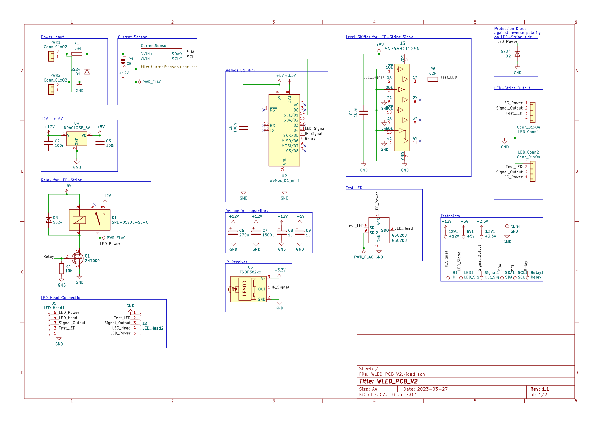

# WLED PCB V2

This is an ESP8266 based controller to drive addressable 12V [GS8208](www.normandled.com/upload/201805/GS8208%20LED%20Datasheet.pdf) LED Strips with the amazing [WLED](https://github.com/Aircoookie/WLED) firmware.

**This PCB was designed in [KiCad](https://www.kicad.org/).**

## Features

- Dimensions 95mm x 40mm
- Onboard LED for testing
- Fuse for overcurrent protection
- Reverse polarity protection for input and output
- [Recommended](https://kno.wled.ge/basics/compatible-hardware/#levelshifters) SN74AHCT125N Levelshifter
- Multiple decoupling capacitors
- IR receiver
- Relay for completely switching of the LED Stripe
- INA219 power sensor
- Multiple test points
- Onboard LED Stripe extension adapter

## Goal

This PCB was designed as an LED Stripe controller board for digital 12V GS8208 LED Strips built into a shelf. Therefore, it had to be easy to connect the LED Strips on either side of the board (depending if the board is mounted on the left or right side of the shelf). In addition, the LED Stripe hat to be easy extendable over the board, so the LED Stripe doesn't end before the shelf ends.

## More Information

Due to the backup line of the GS8208 LED design it is possible to completely remove the test led or the onboard led stripe extension adapter.

## Warning

In my first revision I connected the INA219 improperly. Therefore, I was unable to use it and never got to actually implementing the sensor into WLED. I updated the schematics and board to connect the INA219 sensor properly, but better check twice.

## WLED PCB V2

### Schematic




### PCB


#### Front


#### Back


## WLED PCB V2 LEDs

This is the onboard LED Stripe extension adapter, to extend the LED Stripe over the PCB board, so that the light ends at the end of the shelf. It contains 3 more GS8208 LEDs to extend the LED Stripe. By design it is possible to mount it in both directions, so it can be swapped if the controller is mounted on the other side of the shelf.

### Schematic


### PCB

The PCB is 14.25mm x 40.00mm.


#### Front


#### Back


## Additional Information

### Photos


### PcbDraw Command for PCB Images

[PcbDraw](https://github.com/yaqwsx/PcbDraw) is a tool for generating nice looking PCB images from KiCad files.

```
pcbdraw plot WLED_PCB_V2_LEDs.kicad_pcb PCB_Back.png --side back --style set-blue-cu --no-components
```

## License

This project is licensed under the GNU GPLv3.